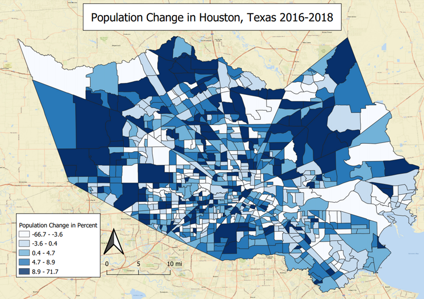
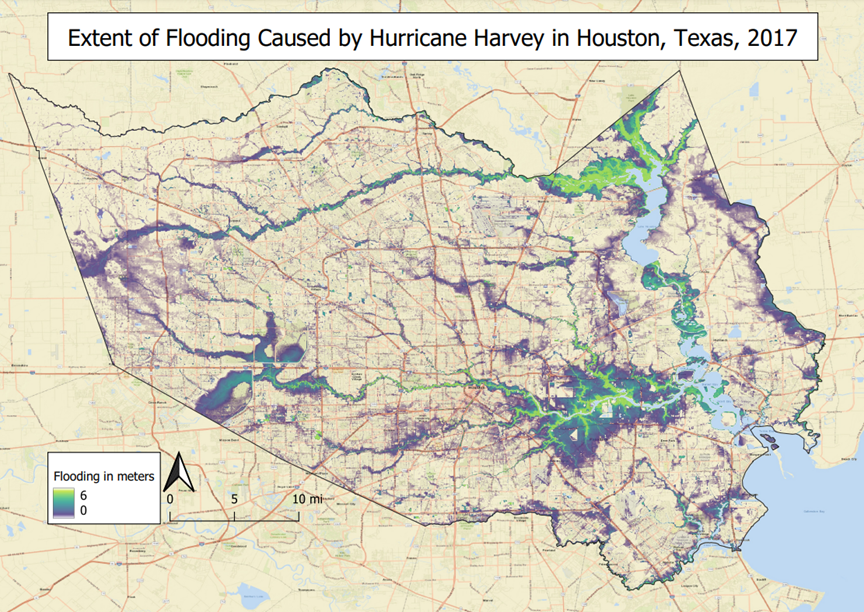
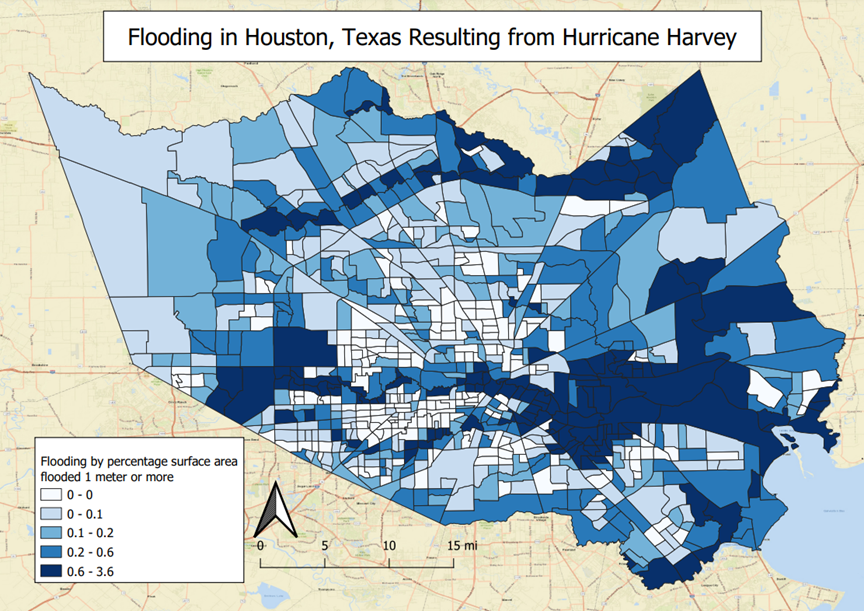
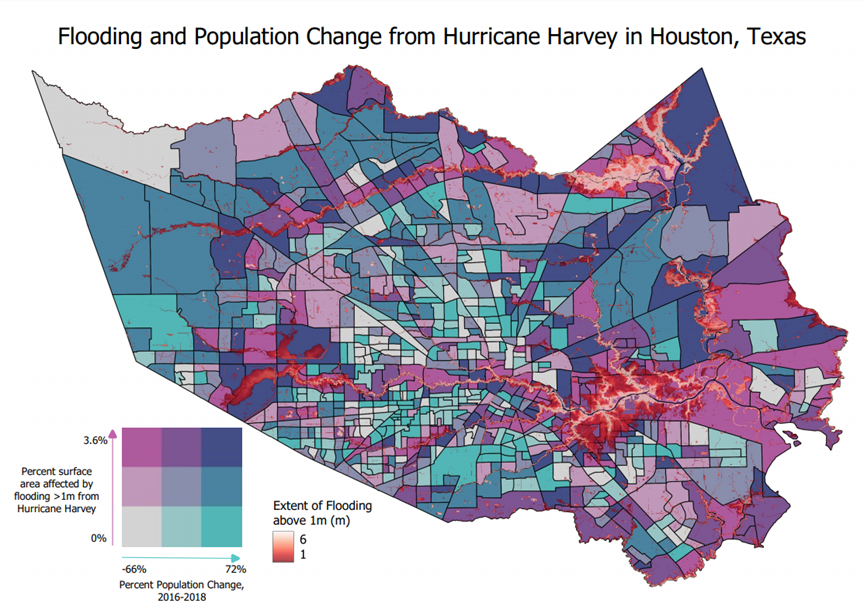

# Hurricane Harvey

---
Hurricane Harvey was a category 4 hurricane that made landfall in Texas on August 25th, 2017. The hurricane brought with it massive flooding that devistated Texas and Louisiana. This was particurarily devistating in the area in and arround around Houston, Texas. Nearly 50% of the total rainfall from the hurricane fell in the area around Houston, with peak rainfall up to 60 inches over the corse of the storm. The rain accumulated in Texas was so high, the National Weather Service had to add 2 new colors to its rain index. Overall, the storm delt an estimated $125 billion in damage, and claimed the lives of 68 people.

The goal of my project is to quantify the effects of the flooding, and find out how it may have impacted the population in Houston.

---

### Step 1: Population

First, I gathered population data. 
* Tidycensus was used through Rstudio to collect this data from the American Community Survey.
* Houston is located in Harris County, Texas, so this is the target for data collection.
* Data was collected from 2016 and 2018, to quantify change for the hurricane that occured in 2017.
* The data collected was then transformed into WGS 84, and stored as a geojson file to be used through Qgis.
* The geojson files were then uploaded into Qgis, where they were joined together to make one dataset.
* The field calculator was then used to calculated change in population, and then to calculate the population change in percent
* These resulting data is displayed on the following choropleth map.

---

### Step 2: Flooding

Next I wanted to quantify flooding caused by the storm.

* I found a raster data set that displayed the flooding that occured due to Hurricane Harvey. The raster was provided by Michael Wehner from Lawrence Berkeley National Laboratory and Christopher Sampson from Fathom Global and can be found at the following link.
https://portal.nersc.gov/cascade/Harvey/
* Data for the raster is provided in meters with 30 meter spatial resolution. 
* These resulting data is displayed on the following map.

---

### Step 3: Compare

The end goal of the project is to find a way to compare flooding to population change.

I decided to quantify flooding by the percent surface area of each census tract that was affected by flood. I chose to use flooding above 1 meter, becasue it was an easy number to work with and demonstrates substantial flooding. Using the entire raster data set resulted in an oversaturation of flooding data that made analysis difficult.

* To start, Raster calculation was done to find all areas that were flooded greater than or equal to 1 meter, and to remove area with permanent standing water.
* I then turned the raster into a vector data set so I could quantify the surface area of the flooding.
* One I had my vector data set with each cell of the raster turned into a polygon, I did a spatial join to join the flooding data to the population census tracts.
* One all the flood data was joined to the census tracts, I was able to calculate the area of the flooding that occured in each tract using the raster calculator.
* The surface area of flooding could then be divided by the area of the tract to find the percent surface area that each tract was flooded. 
* The resulting data is displayed on the following choropleth map.

* The two shapefiles were then used to make a bivariate choropleth map showing change in population from 2016-2018 on one axis, and percent surface area flooding on the other axis. 
* These data as well as the raster showing the extent of flooding equal to or above 1 meter is displayed on the following map.

---

### Web Map

I also made this data available as a web map, which can be found below.
Census tracts can be clicked to see data on population and flooding.

Web mao can be found [here](qgis2web_2021_05_20-03_26_41_707581/index.html)

---

